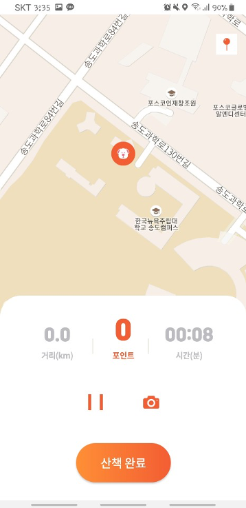

# CSE 323 Team Puppies

## 1. Team Members

| Name | Email |
| ------ | ------ |
| David Cha | david.j.cha@stonybrook.edu |
| Dong Hun Kim | donghun.kim@stonybrook.edu|
| Hojin Jeong | hojin.jeong@stonybrook.edu |
| Hyeon Joon Lee | hyeonjoon.lee@stonybrook.edu

## 2. Target User Population

People who wish to walk their dogs. Those may include hired dog walkers.

## 3. The Problem Our Product Will Be Solving

We wish to provide a user-friendly app that will benefit the dog walkers by introducing nearby dog-friendly shops, cafes, or any other facilities. Our product differ from other existing solutions in the sense that it will provide a number of additional features while managing to keep the UI intuitive.

## 4. Related Solutions

### A. [Mobile Application] PetIn (펫인)  
Play Store: <https://play.google.com/store/apps/details?id=net.petin&hl=ko>  
App Store: <https://apps.apple.com/kr/app/%ED%8E%AB%EC%9D%B8/id1441271868>  

**Features:**

**1. Advising users to walk their pets or not.**

- On the main page, the current find dust concentration and temperature are shown, and the app tells you whether it’s an optimal day to go out for a walk or not.

**2. Recording walking sessions can be done with a single button.**  

**3. While actually walking, the app displays the distance traveled and offers a function to keep track of your pet’s activity such as drinking water and leaving any excrements.**

**Our Thoughts and Possible Improvements:**  

- Show any cafe, accommodations, and pet hospitals that allow pets to be in on the map (shows those while walking as well as within a dedicated map).  
- Recommended walking course (public parks or a non-steep walkway, or in other words, a place where walking would be comfortable).   
- Point system for giving incentive for activities (motivates people).  
- A service that does the walking for you when you’re not available (a possible name could be “PetWalker”).
- An alarm for an upcoming walking schedule.
- Alerts you when the weather is about to change (rain, turning cold, etc), or when the air quality is getting worse (in which the user is advised to stop any activities and head home)

### B. [Mobile Application] PetP (펫피)

**Features:**  

**1. Accumulate points when you are walking your pet. Use the points to discount pet products such as treats, food, diapers, mattress, and etc.**  

- Time and distance counts towards the points.  
- Displays a map with your current location.  
- Pause button.
- Take a photo button.  

**2. Has a community forum where pet-people can share photo shots with their pets.**  

 

**3. Shopping mall where one can checkout items that he/she wants.**  

**Inconveniences Users Found:**

- Cannot log into an account with several devices at the same time
- When walking several dogs together, users cannot track one dog at a time.
- Disconnection while walking the dog causes losing points.
- Selling products more expensive than other places.  
- Does not have options to select uncommon breeds.

**Our Thoughts and Possible Improvements:**

- Simple and intuitive to use.  
- Useful to owners who like to share photos of their pets while walking.
- I would like to add a feature that display shops/restaurants where pets are allowed to enter.
- Add a feature that displays current weather/air pollution level.
- Discount products that are sold is too less of a motivation for owners to take dogs out for a walk.

## 5. Our Plan to Find People in Our Target Population

The success of our project depends on active interactions between developers and possible users. Therefore, each of our team members will interview several people that owns a dog. Conducting the majority of those interviews in-person, we will first show them our abstract design and user interface, and gain direct feedbacks. The feedbacks will include desirable features, possible improvements, redundancies, and flaws.
